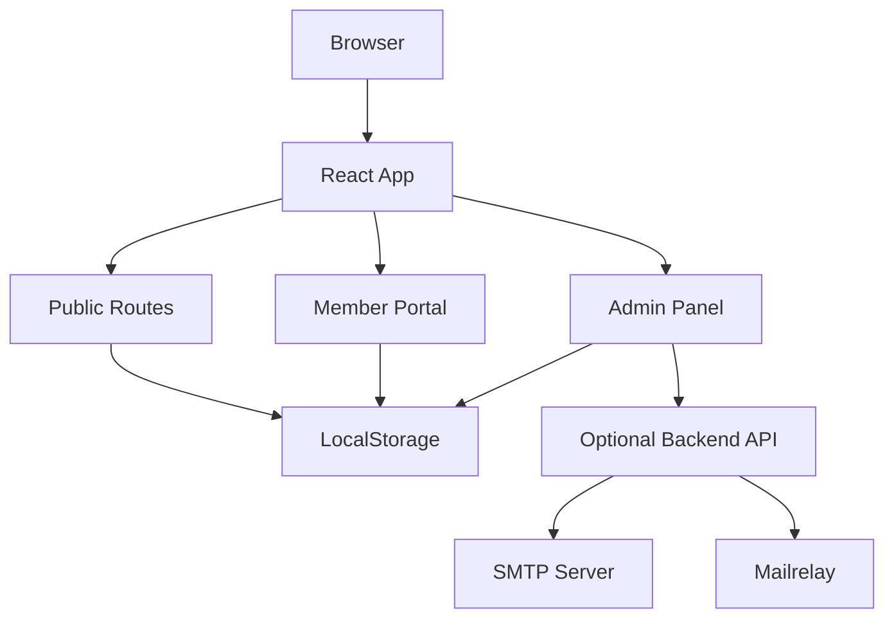
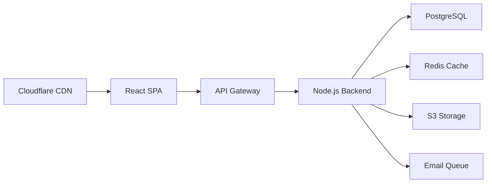

# Platform Architecture

CAFH Platform is built as a single-page application (SPA) with a modular, component-based architecture. This guide explains how all the pieces fit together.

## High-Level Overview



## Application Layers

The platform is organized into distinct layers:

<CardGroup cols={2}>
  <Card title="Presentation Layer" icon="desktop">
    React components with Tailwind CSS styling
  </Card>
  <Card title="Business Logic" icon="brain">
    Route guards, data transformations, validation
  </Card>
  <Card title="Data Layer" icon="database">
    LocalStorage API with structured keys and schemas
  </Card>
  <Card title="Integration Layer" icon="plug">
    Optional external services (SMTP, Mailrelay, Zoom)
  </Card>
</CardGroup>

## Core Components

### 1. Routing System (App.tsx)

The application uses React Router v6 with hash-based routing for compatibility:

```typescript
// App.tsx:64-119
<HashRouter>
  <Routes>
    {/* Public routes - no authentication required */}
    <Route path="/" element={<PublicLayoutWrapper><HomeView /></PublicLayoutWrapper>} />
    <Route path="/about" element={<PublicLayoutWrapper><DynamicPageView slug="quienes-somos" /></PublicLayoutWrapper>} />
    
    {/* Member routes - requires MEMBER role */}
    <Route path="/member/dashboard" element={
      <ProtectedRoute allowedRoles={[UserRole.MEMBER]}>
        <MemberDashboard />
      </ProtectedRoute>
    } />
    
    {/* Admin routes - requires ADMIN or SUPER_ADMIN role */}
    <Route path="/admin" element={
      <ProtectedRoute allowedRoles={[UserRole.ADMIN, UserRole.SUPER_ADMIN]}>
        <AdminLayout><DashboardView /></AdminLayout>
      </ProtectedRoute>
    } />
  </Routes>
</HashRouter>
```

### 2. Authentication Guard (App.tsx:33-47)

The `ProtectedRoute` component enforces role-based access control:

```typescript
const ProtectedRoute: React.FC<{ children: React.ReactNode; allowedRoles?: UserRole[] }> = 
  ({ children, allowedRoles }) => {
    const user = db.auth.getCurrentUser();

    // Redirect to login if not authenticated
    if (!user) {
      return <Navigate to="/login" replace />;
    }

    // Redirect to appropriate dashboard if role not allowed
    if (allowedRoles && !allowedRoles.includes(user.role)) {
      return <Navigate to={user.role === UserRole.MEMBER ? "/member/dashboard" : "/admin"} replace />;
    }

    return <>{children}</>;
};
```

### 3. Data Storage System (storage.ts)

The platform uses a structured localStorage API that simulates a database:

```typescript
// storage.ts:4-37
const KEYS = {
  BLOG: 'cafh_blog_v1',
  EVENTS: 'cafh_events_v1',
  CONTACTS: 'cafh_contacts_v1',
  CAMPAIGNS: 'cafh_campaigns_v1',
  AUTOMATIONS: 'cafh_automations_v1',
  MEDIA: 'cafh_media_v1',
  // ... 25+ storage keys
};

// Database API
export const db = {
  init: () => { /* Initialize all stores with defaults */ },
  auth: { /* Authentication methods */ },
  blog: { /* Blog CRUD operations */ },
  crm: { /* Contact management */ },
  campaigns: { /* Email campaigns */ },
  automations: { /* Workflow engine */ },
  cms: { /* Page builder */ },
  // ... more modules
};
```

<Note>
  All data is versioned (e.g., `_v1` suffix) to allow for future schema migrations without breaking existing data.
</Note>

## Data Flow Patterns

### Reading Data

```typescript
// 1. Component calls storage API
const contacts = db.crm.getAll();

// 2. Storage API reads from localStorage
const stored = localStorage.getItem('cafh_contacts_v1');

// 3. Parse and return
return JSON.parse(stored || '[]');
```

### Writing Data

```typescript
// 1. Component calls storage API with new data
db.crm.add(newContact);

// 2. Storage API updates in-memory data
const all = db.crm.getAll();
all.push(newContact);

// 3. Persist to localStorage
localStorage.setItem('cafh_contacts_v1', JSON.stringify(all));

// 4. (Optional) Sync to backend API
await fetch('/api/contacts', { method: 'POST', body: JSON.stringify(newContact) });
```

## Module Architecture

### Public Website Module

Handles all unauthenticated user interactions:

- **Homepage** (HomeView): Dynamic hero, search, blog section
- **Dynamic Pages** (DynamicPageView): CMS-driven pages from `cafh_pages_v1`
- **Navigation** (PublicHeader): Mega menu from `cafh_menu_v1`
- **Footer** (PublicFooter): Links and newsletter subscription

### Member Portal Module

Personalized experience for authenticated members:

```typescript
// Member Dashboard Structure
- Activity History (cafh_user_history_v1)
- Upcoming Events (cafh_events_v1 + cafh_activity_events_v1)
- Recommended Content (filtered by user.interests from types.ts:30)
- Zoom Widget (cafh_zoom_widget_v1)
- Badges & Achievements (cafh_badges_v1)
```

### Admin Panel Module

Complete management interface with 10 sub-modules:

<Tabs>
  <Tab title="Dashboard">
    **Path**: `/admin`
    
    Analytics overview:
    - Contact growth charts
    - Email campaign metrics
    - Content views
    - Recent activity log
  </Tab>
  
  <Tab title="CRM">
    **Path**: `/admin/crm`
    
    Contact management:
    - Contact list with filters
    - Engagement scoring
    - Tags and segmentation
    - Email history per contact
    - CSV import/export
  </Tab>
  
  <Tab title="Automations">
    **Path**: `/admin/automations`
    
    Workflow engine:
    - Visual flow builder
    - Trigger configuration
    - Node types: send_email, wait, condition, update_tag, move_to_list
    - Execution logs
  </Tab>
  
  <Tab title="CMS">
    **Path**: `/admin/cms`
    
    Content management:
    - Page builder with sections
    - Blog post editor
    - Homepage configuration
    - Menu editor
    - SEO settings
  </Tab>
  
  <Tab title="Media Library">
    **Path**: `/admin/media`
    
    Asset management:
    - Upload images, videos, documents, audio
    - Tag-based organization
    - Folder system
    - File size and dimension display
  </Tab>
  
  <Tab title="Analytics">
    **Path**: `/admin/analytics`
    
    Performance tracking:
    - Email open/click rates
    - Content consumption patterns
    - Member engagement scores
    - Traffic sources
  </Tab>
</Tabs>

### Virtual Meetings Module (Module 1)

Zoom integration with enhanced lobby experience:

```typescript
// Module Components (types.ts:628-701)
- ZoomWidgetConfig: Customizable widget for member dashboard
- MeetingAgendaItem: Structured agenda with time estimates
- MeetingMediaRef: References to media library (read-only)
- FeedbackQuestion: Post-session survey system
- FeedbackResponse: Collected feedback data
- MemberBadge: Gamification rewards
- ParticipationRecord: Attendance tracking
```

**Key Features**:
- Pre-meeting lobby with agenda and resources
- One-click Zoom launch
- Post-session feedback forms
- Participation history tracking
- Badge system for engagement

### Activity Calendar Module (Module 2)

Event management with multi-modality support:

```typescript
// Module Components (types.ts:703-738)
- ActivityCategory: Configurable event types (Meditation, Study, Retreat, etc.)
- ActivityEvent: Full event entity with modality support
- Modalities: 'Virtual' | 'Presencial' | 'Híbrida'
- Bi-directional sync with Module 1 for virtual events
```

## State Management

<Warning>
  The platform does NOT use Redux, Zustand, or other state management libraries. All state is managed through React component state and localStorage.
</Warning>

### State Patterns Used

1. **Local Component State**: For UI-only state (modals, forms)
2. **LocalStorage as Source of Truth**: For persisted data
3. **URL State**: For navigation and deep linking
4. **Context** (minimal): Only for auth user in layout components

## Performance Considerations

### Optimizations

- **Lazy Loading**: Dynamic imports for large admin modules
- **Pagination**: Contact lists limited to 100 items per page
- **Debouncing**: Search inputs debounced at 300ms
- **Memoization**: Heavy computations cached with `useMemo`
- **Virtual Scrolling**: Media library uses windowing for 1000+ items

### Storage Limits

```typescript
// Maximum recommended data sizes
const LIMITS = {
  contacts: 5000,        // storage.ts:659
  emailLogs: 5000,       // storage.ts:436
  interactions: 5000,    // storage.ts:436
  changeLogs: 100,       // storage.ts:473
  executions: 500        // storage.ts:950
};
```

<Note>
  LocalStorage has a typical limit of 5-10MB per domain. The platform is designed to stay under 5MB with typical usage.
</Note>

## Integration Points

### Optional Backend API

The platform can integrate with a Node.js backend for production features:

```typescript
// Email Queue Endpoint
POST /api/email/queue
Body: { recipients: string[], subject: string, content: string }
Response: { success: boolean, queuedCount: number }

// Queue Status Endpoint
GET /api/email/status
Response: { pending: number, sent: number, failed: number, sentCountThisHour: number, limit: number }
```

### External Services

<CardGroup cols={2}>
  <Card title="Mailrelay API" icon="mail">
    Sync contacts to external email service (storage.ts:805-813)
  </Card>
  <Card title="Zoom API" icon="video">
    Create and manage meetings programmatically
  </Card>
  <Card title="Google Analytics" icon="chart-line">
    Track page views and conversions
  </Card>
  <Card title="Meta Pixel" icon="facebook">
    Facebook advertising and retargeting
  </Card>
</CardGroup>

## Security Architecture

### Authentication (storage.ts:303-349)

```typescript
db.auth.login(email, password) {
  // In prototype: hardcoded credentials
  // In production: hash comparison, JWT generation
  
  if (authenticated) {
    localStorage.setItem('cafh_user_session_v1', JSON.stringify(user));
    return user;
  }
  return null;
}
```

<Warning>
  **Production Security Checklist**:
  - Replace hardcoded credentials with hashed passwords
  - Implement JWT or session-based auth
  - Add CSRF protection
  - Sanitize all user inputs
  - Implement rate limiting
  - Use HTTPS in production
  - Add Content Security Policy headers
</Warning>

## Deployment Architecture

Recommended production setup:



### Build Process

```bash
# Development
npm run dev        # Vite dev server with HMR

# Production
npm run build      # TypeScript compilation + Vite build
npm run preview    # Test production build locally
```

## Next Steps

<CardGroup cols={2}>
  <Card title="User Roles" icon="shield" href="/concepts/user-roles">
    Learn about the five-tier permission system
  </Card>
  <Card title="Multi-Tenancy" icon="building" href="/concepts/multi-tenancy">
    Understand how tenant isolation works
  </Card>
  <Card title="Data Model" icon="database" href="/concepts/data-model">
    Deep dive into all entities and relationships
  </Card>
</CardGroup>