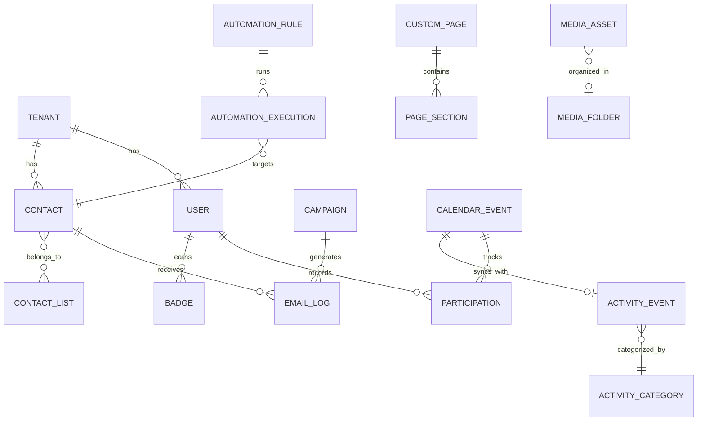

# Data Model Overview

CAFH Platform uses a comprehensive data model with 50+ entity types organized into logical modules. This guide provides a complete reference of all entities and their relationships.

## Storage Architecture

The platform uses a key-value storage system with structured keys:

```typescript
// storage.ts:4-37
const KEYS = {
  // Core Data
  BLOG: 'cafh_blog_v1',
  EVENTS: 'cafh_events_v1',
  CONTENT: 'cafh_content_v1',
  
  // CRM
  CONTACTS: 'cafh_contacts_v1',
  CRM_LISTS: 'cafh_crm_lists_v1',
  
  // Email
  EMAIL_LOGS: 'cafh_email_logs_v1',
  EMAIL_METRICS: 'cafh_email_metrics_v1',
  CAMPAIGNS: 'cafh_campaigns_v1',
  
  // Automation
  AUTOMATIONS: 'cafh_automations_v1',
  AUTOMATION_EXECUTIONS: 'cafh_automation_executions_v1',
  
  // CMS
  CUSTOM_PAGES: 'cafh_pages_v1',
  HOME_CONFIG: 'cafh_home_config_v1',
  MEGA_MENU: 'cafh_menu_v1',
  CHANGE_LOG: 'cafh_changelog_v1',
  
  // Media
  MEDIA: 'cafh_media_v1',
  
  // Module 1: Virtual Meetings
  FEEDBACK_QUESTIONS: 'cafh_feedback_q_v1',
  FEEDBACK_RESPONSES: 'cafh_feedback_r_v1',
  MEMBER_BADGES: 'cafh_badges_v1',
  PARTICIPATION: 'cafh_participation_v1',
  ZOOM_WIDGET: 'cafh_zoom_widget_v1',
  
  // Module 2: Activity Calendar
  ACTIVITY_EVENTS: 'cafh_activity_events_v1',
  ACTIVITY_CATS: 'cafh_activity_cats_v1',
};
```

<Note>
  All keys are versioned (`_v1`) to support future schema migrations.
</Note>

## Core Entities

### Tenant (types.ts:2-11)

```typescript
export interface Tenant {
  id: string;               // Primary key: 't_santiago_01'
  name: string;             // Display name
  domain: string;           // Primary domain: 'cafh.cl'
  theme: {
    primaryColor: string;   // Hex color: '#1A428A'
    logoUrl: string;        // Asset URL
  };
}
```

**Relationships**:
- `1:N` with User (one tenant has many users)
- `1:N` with all content entities (scoped by tenantId)

### User (types.ts:22-35)

```typescript
export interface User {
  id: string;               // Primary key: 'u_admin'
  name: string;
  email: string;            // Unique per tenant
  role: UserRole;           // SUPER_ADMIN | ADMIN | EDITOR | MEMBER | GUEST
  avatarUrl: string;
  tenantId: string;         // Foreign key → Tenant.id
  interests: string[];      // Tags from wizard: ['Meditación', 'Bienestar']
  joinedDate: string;       // ISO date: '2023-10-15'
  coverUrl?: string;        // Profile cover image
  phone?: string;
  city?: string;
}
```

**Relationships**:
- `N:1` with Tenant (many users belong to one tenant)
- `1:N` with UserActivity (activity history)
- `1:N` with ContentInteraction (content views)
- `1:1` with UserWizardProfile (onboarding results)

**Storage Key**: `cafh_user_session_v1` (current user only)

### UserRole (types.ts:14-20)

```typescript
export enum UserRole {
  SUPER_ADMIN = 'SUPER_ADMIN',  // Platform administrator
  ADMIN = 'ADMIN',              // Tenant administrator
  EDITOR = 'EDITOR',            // Content manager
  MEMBER = 'MEMBER',            // Registered user
  GUEST = 'GUEST'               // Unauthenticated
}
```

## CRM Entities

### Contact (types.ts:268-286)

```typescript
export interface Contact {
  id: string;                              // Primary key
  name: string;
  firstName?: string;
  lastName?: string;
  email: string;                           // Unique
  phone: string;
  role: string;                            // 'Member' | 'Lead' | 'Donor'
  status: 'Subscribed' | 'Unsubscribed' | 'Bounced' | 'Pending' | 'new';
  lastContact: string;                     // ISO date
  tags: string[];                          // ['Miembro', 'Donante']
  notes?: string;
  engagementScore?: number;                // 0-100
  mailrelayId?: string;                    // External system ID
  city?: string;
  country?: string;
  createdAt?: string;
  listIds?: string[];                      // Foreign keys → ContactList.id[]
}
```

**Relationships**:
- `N:M` with ContactList (via `listIds` array)
- `1:N` with EmailLog
- `1:N` with AutomationExecution

**Storage Key**: `cafh_contacts_v1`

### ContactList (types.ts:260-266)

```typescript
export interface ContactList {
  id: string;               // Primary key
  name: string;             // 'Newsletter Subscribers'
  description: string;
  createdAt: string;
  contactCount?: number;    // Computed from contacts.listIds
}
```

**Relationships**:
- `N:M` with Contact (many-to-many through `Contact.listIds`)

**Storage Key**: `cafh_crm_lists_v1`

## Email Entities

### Campaign (types.ts:358-377)

```typescript
export interface Campaign {
  id: string;                              // Primary key
  name: string;                            // Internal name
  subject: string;                         // Email subject line
  content: string;                         // HTML content
  status: 'Draft' | 'Scheduled' | 'Sent' | 'Testing';
  recipientType: 'all' | 'subscribed' | 'list';
  listId?: string;                         // Foreign key if recipientType='list'
  recipientCount: number;                  // Snapshot at send time
  createdAt: string;
  sentAt?: string;
  scheduledAt?: string;
  testEmail?: string;                      // Last test recipient
  metrics: {
    sent: number;
    opened: number;
    clicked: number;
    bounced: number;
  };
}
```

**Relationships**:
- `N:1` with ContactList (if recipientType='list')
- `1:N` with EmailLog (one campaign generates many logs)

**Storage Key**: `cafh_campaigns_v1`

### EmailLog (types.ts:288-298)

```typescript
export interface EmailLog {
  id: string;                              // Primary key
  contactId: string;                       // Foreign key → Contact.id
  subject: string;
  sentAt: string;                          // Timestamp: '2023-10-25 10:00'
  status: 'Delivered' | 'Opened' | 'Clicked' | 'Bounced' | 'Failed' | 'Queued';
  openedAt?: string;
  clickedAt?: string;
  errorMessage?: string;
  campaignName?: string;                   // For grouping
}
```

**Relationships**:
- `N:1` with Contact
- `N:1` with Campaign (via campaignName)

**Storage Key**: `cafh_email_logs_v1`

### EmailMetrics (types.ts:300-306)

```typescript
export interface EmailMetrics {
  totalSent: number;
  openRate: number;        // Percentage
  clickRate: number;       // Percentage
  bounceRate: number;      // Percentage
  history: {
    date: string;          // '2023-10-20'
    sent: number;
    opened: number;
    clicked: number;
  }[];
}
```

**Storage Key**: `cafh_email_metrics_v1`

## Automation Entities

### AutomationRule (types.ts:466-482)

```typescript
export interface AutomationRule {
  id: string;                              // Primary key
  name: string;
  description?: string;
  status: 'Active' | 'Paused' | 'Draft';
  trigger: AutomationTrigger;              // When to start
  nodes: AutomationNode[];                 // Workflow steps
  nodePositions?: Record<string, { x: number; y: number }>; // For visual editor
  createdAt: string;
  updatedAt: string;
  stats: {
    totalExecutions: number;
    completed: number;
    emailsSent: number;
    tagsApplied: number;
  };
}
```

**Relationships**:
- `1:N` with AutomationExecution

**Storage Key**: `cafh_automations_v1`

### AutomationTrigger (types.ts:383-400)

```typescript
export type AutomationTriggerType =
  | 'contact_added_to_list'
  | 'tag_added'
  | 'campaign_sent'
  | 'campaign_opened'
  | 'campaign_clicked'
  | 'no_activity'
  | 'scheduled_date'
  | 'manual';

export interface AutomationTrigger {
  type: AutomationTriggerType;
  listId?: string;           // For 'contact_added_to_list'
  tag?: string;              // For 'tag_added'
  campaignId?: string;       // For campaign events
  inactiveDays?: number;     // For 'no_activity'
  scheduledAt?: string;      // For 'scheduled_date'
}
```

### AutomationNode Types (types.ts:402-452)

```typescript
export type AutomationNodeType =
  | 'send_email'
  | 'wait'
  | 'condition'
  | 'update_tag'
  | 'move_to_list'
  | 'end';

// Each node type has its own interface
export interface SendEmailNode {
  id: string;
  type: 'send_email';
  subject: string;
  content: string;           // HTML
  fromName?: string;
}

export interface WaitNode {
  id: string;
  type: 'wait';
  amount: number;
  unit: 'minutes' | 'hours' | 'days';
}

export interface ConditionNode {
  id: string;
  type: 'condition';
  check: 'email_opened' | 'email_clicked' | 'has_tag' | 'in_list';
  value?: string;
  branchTrue: AutomationNode[];   // Recursive
  branchFalse: AutomationNode[];  // Recursive
}

export interface UpdateTagNode {
  id: string;
  type: 'update_tag';
  action: 'add' | 'remove';
  tag: string;
}

export interface MoveToListNode {
  id: string;
  type: 'move_to_list';
  listId: string;            // Foreign key → ContactList.id
}

export interface EndNode {
  id: string;
  type: 'end';
}

export type AutomationNode =
  | SendEmailNode
  | WaitNode
  | ConditionNode
  | UpdateTagNode
  | MoveToListNode
  | EndNode;
```

### AutomationExecution (types.ts:454-464)

```typescript
export interface AutomationExecution {
  id: string;                              // Primary key
  automationId: string;                    // Foreign key → AutomationRule.id
  contactId: string;                       // Foreign key → Contact.id
  contactEmail: string;                    // Denormalized for display
  startedAt: string;
  completedAt?: string;
  currentStep: number;                     // Progress tracker
  status: 'running' | 'completed' | 'failed';
  log: string[];                           // Debug messages
}
```

**Storage Key**: `cafh_automation_executions_v1`

## CMS Entities

### CustomPage (types.ts:194-201)

```typescript
export interface CustomPage {
  id: string;               // Primary key: 'p_historia_01'
  slug: string;             // URL slug: 'quienes-somos'
  title: string;            // Page title
  status: 'Published' | 'Draft';
  sections: PageSection[];  // Array of content blocks
  seo: SEOConfig;
}
```

**Relationships**:
- `1:N` with PageSection (composition)

**Storage Key**: `cafh_pages_v1`

### PageSection (types.ts:182-192)

```typescript
export interface PageSection {
  id: string;               // Primary key within page
  type: 'Text' | 'Image' | 'Gallery' | 'Stats' | 'Cards' | 'IconGrid' | 'Hero' | 
        'Video' | 'CTA' | 'Accordion' | 'ResourcesGrid' | 'EventsCalendar' | 
        'Timeline' | 'MethodPillars';
  content: any;             // Type-specific content (flexible)
  order: number;            // Display order
  settings?: {
    backgroundColor?: string;
    padding?: 'small' | 'medium' | 'large';
    containerSize?: 'narrow' | 'standard' | 'full';
  };
}
```

### BlogPost (types.ts:101-111)

```typescript
export interface BlogPost {
  id: string;               // Primary key
  title: string;
  excerpt: string;          // Short summary
  category: string;         // 'Vida Interior', 'Comunidad', etc.
  imageUrl: string;         // Featured image
  date: string;             // Display date: '2 Oct, 2023'
  author: string;           // Author name
  content?: string;         // Full HTML/Markdown
  seo?: SEOConfig;
}
```

**Storage Key**: `cafh_blog_v1`

### HomeConfig (types.ts:165-179)

```typescript
export interface HomeConfig {
  hero: HeroConfig;                        // Hero section config
  searchSubtitle: string;                  // '¿Qué buscas hoy?'
  searchItems: SearchItem[];               // Quick links
  threeColumns: HomeThreeColumn[];         // 3-column section
  blogSection: BlogConfig;                 // Blog carousel config
  activitiesSection: {
    title: string;
    subtitle: string;
    maxEvents: number;
    order: number;
  };
  sectionOrder: string[];                  // ['hero', 'search', 'threeColumns', ...]
  footer: FooterConfig;
}
```

**Storage Key**: `cafh_home_config_v1`

### SEOConfig (types.ts:69-75)

```typescript
export interface SEOConfig {
  title: string;            // Page title
  description: string;      // Meta description
  keywords: string[];       // Keywords array
  ogImage?: string;         // Open Graph image
  schemaType?: string;      // 'Article', 'Event', 'Organization'
}
```

## Media Entities

### MediaAsset (types.ts:319-329)

```typescript
export interface MediaAsset {
  id: string;               // Primary key
  name: string;             // Filename
  type: 'image' | 'video' | 'document' | 'audio';
  url: string;              // CDN URL or local path
  size: string;             // '2.4 MB'
  dimensions?: string;      // '1920x1080' (for images/videos)
  uploadedAt: string;       // ISO date
  tags: string[];           // ['Eventos', 'Retiro']
  folderId?: string;        // Foreign key → MediaFolder.id
}
```

**Storage Key**: `cafh_media_v1`

### MediaFolder (types.ts:331-335)

```typescript
export interface MediaFolder {
  id: string;               // Primary key
  name: string;
  parentId?: string;        // Self-referential for nested folders
}
```

## Event Entities

### CalendarEvent (types.ts:224-248)

```typescript
export interface CalendarEvent {
  id: string;                              // Primary key
  title: string;
  date: string;                            // ISO date: '2023-11-15'
  day: string;                             // Display: '15'
  month: string;                           // Display: 'NOV'
  time: string;                            // '19:00 hrs'
  location: string;                        // 'Sede Central, Ñuñoa'
  type: 'Presencial' | 'Online' | 'Híbrido';
  color: string;                           // Tailwind class: 'bg-cafh-turquoise'
  meetingUrl?: string;                     // Zoom/Meet link
  zoomId?: string;
  zoomPassword?: string;
  platform?: 'Zoom';                       // Only Zoom supported
  agenda?: string[];                       // Legacy array of strings
  resources?: EventResource[];             // Legacy attachments
  seo?: SEOConfig;
  // Module 1 fields:
  organizerContactId?: string;             // Foreign key → Contact.id
  mediaRefs?: MeetingMediaRef[];           // References to MediaAsset
  agendaItems?: MeetingAgendaItem[];       // Structured agenda
  zoomWidgetConfig?: ZoomWidgetConfig;
  eventStatus?: 'Programada' | 'En curso' | 'Finalizada';
  linkedActivityId?: string;               // Foreign key → ActivityEvent.id (sync)
}
```

**Relationships**:
- `N:1` with Contact (organizer)
- `N:M` with MediaAsset (via `mediaRefs`)
- `1:1` with ActivityEvent (bi-directional sync)

**Storage Key**: `cafh_events_v1`

### ActivityEvent (types.ts:717-738)

```typescript
export interface ActivityEvent {
  id: string;                              // Primary key
  title: string;
  description: string;                     // Rich text HTML
  category: string;                        // Foreign key → ActivityCategory.id
  tags: string[];
  startDate: string;                       // 'YYYY-MM-DD'
  endDate: string;
  startTime: string;                       // 'HH:MM'
  endTime: string;
  modality: 'Virtual' | 'Presencial' | 'Híbrida';
  organizerContactId?: string;             // Foreign key → Contact.id
  status: 'Borrador' | 'Publicado' | 'Archivado';
  imageUrl?: string;
  seo?: SEOConfig;
  featuredInDashboard: boolean;            // Show in member dashboard
  linkedMeetingId?: string;                // Foreign key → CalendarEvent.id (sync)
  zoomUrl?: string;                        // If virtual
  createdAt: string;
  updatedAt: string;
}
```

**Storage Key**: `cafh_activity_events_v1`

### ActivityCategory (types.ts:708-713)

```typescript
export interface ActivityCategory {
  id: string;               // Primary key
  name: string;             // 'Meditación', 'Estudio', 'Retiro'
  color: string;            // Hex: '#6366f1'
  icon: string;             // Lucide icon name: 'Feather'
}
```

**Storage Key**: `cafh_activity_cats_v1`

## Module 1: Virtual Meetings

### MeetingAgendaItem (types.ts:630-637)

```typescript
export interface MeetingAgendaItem {
  id: string;
  order: number;            // Display order
  title: string;            // '20:00 - Bienvenida y Sintonía'
  description?: string;
  durationMinutes: number;  // Time estimate
}
```

### MeetingMediaRef (types.ts:639-643)

```typescript
export interface MeetingMediaRef {
  mediaAssetId: string;     // Foreign key → MediaAsset.id (read-only)
  label?: string;           // Custom label: 'Texto de apoyo'
}
```

### FeedbackQuestion (types.ts:654-662)

```typescript
export interface FeedbackQuestion {
  id: string;               // Primary key
  order: number;
  text: string;             // Question text
  type: 'rating' | 'multiple_choice' | 'text';
  options?: string[];       // For multiple_choice
  isActive: boolean;        // Can be disabled
}
```

**Storage Key**: `cafh_feedback_q_v1`

### FeedbackResponse (types.ts:664-676)

```typescript
export interface FeedbackResponse {
  id: string;               // Primary key
  eventId: string;          // Foreign key → CalendarEvent.id
  userId: string;           // Foreign key → User.id
  userName: string;         // Denormalized
  submittedAt: string;
  answers: {
    questionId: string;
    questionText: string;   // Denormalized
    value: string | number;
  }[];
  overallRating: number;    // 1-5 average for analytics
}
```

**Storage Key**: `cafh_feedback_r_v1`

### MemberBadge (types.ts:682-690)

```typescript
export interface MemberBadge {
  id: string;               // Primary key
  userId: string;           // Foreign key → User.id
  type: BadgeType;          // 'estrella' | 'medalla_bronce' | ...
  label: string;            // Display name
  reason: string;           // Why awarded
  awardedAt: string;
  awardedBy: string;        // Foreign key → User.id (admin)
}
```

**Storage Key**: `cafh_badges_v1`

### ParticipationRecord (types.ts:693-701)

```typescript
export interface ParticipationRecord {
  id: string;               // Primary key
  userId: string;           // Foreign key → User.id
  eventId: string;          // Foreign key → CalendarEvent.id
  eventTitle: string;       // Denormalized
  participatedAt: string;
  feedbackSubmitted: boolean;
  feedbackBlocksNext: boolean; // If true, user must complete feedback
}
```

**Storage Key**: `cafh_participation_v1`

## Entity Relationship Diagram



## Data Access Patterns

### Common Queries

```typescript
// Get all contacts for current tenant
const contacts = db.crm.getAll().filter(c => c.tenantId === currentTenantId);

// Get emails sent to specific contact
const emails = db.emails.getLogs(contactId);

// Get active automations
const active = db.automations.getAll().filter(a => a.status === 'Active');

// Get published pages
const pages = db.cms.getPages().filter(p => p.status === 'Published');

// Get upcoming events
const upcoming = db.events.getAll()
  .filter(e => new Date(e.date) > new Date())
  .sort((a, b) => new Date(a.date).getTime() - new Date(b.date).getTime());
```

### Computed Fields

Some fields are calculated at query time:

```typescript
// Contact engagement score (0-100)
const calculateEngagement = (contact: Contact): number => {
  const emailLogs = db.emails.getLogs(contact.id);
  const openRate = emailLogs.filter(e => e.status === 'Opened').length / emailLogs.length;
  const clickRate = emailLogs.filter(e => e.status === 'Clicked').length / emailLogs.length;
  const recency = daysSince(contact.lastContact);
  
  return Math.round(
    (openRate * 40) + (clickRate * 40) + (Math.max(0, 100 - recency) * 0.2)
  );
};

// Contact list member count
const getListCount = (listId: string): number => {
  return db.crm.getAll().filter(c => c.listIds?.includes(listId)).length;
};
```

## Data Limits & Constraints

<CardGroup cols={2}>
  <Card title="Contacts" icon="users">
    Max 5,000 per tenant (storage.ts:659)
  </Card>
  <Card title="Email Logs" icon="mail">
    Max 5,000 records, oldest pruned (storage.ts:436)
  </Card>
  <Card title="Automation Executions" icon="workflow">
    Max 500 records (storage.ts:950)
  </Card>
  <Card title="Change Logs" icon="history">
    Max 100 records (storage.ts:473)
  </Card>
</CardGroup>

## Related Topics

<CardGroup cols={2}>
  <Card title="User Roles" icon="shield" href="/concepts/user-roles">
    See which roles can access which entities
  </Card>
  <Card title="Multi-Tenancy" icon="building" href="/concepts/multi-tenancy">
    Learn about tenant-scoped data
  </Card>
</CardGroup>