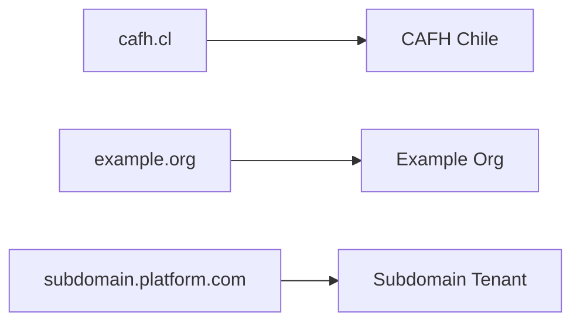

# Multi-Tenancy Architecture

CAFH Platform is designed as a multi-tenant SaaS application, allowing multiple organizations to share the same codebase while maintaining complete data isolation.

## What is Multi-Tenancy?

Multi-tenancy is an architecture where a single instance of the software serves multiple customers (tenants). Each tenant's data is isolated and invisible to other tenants.

<CardGroup cols={2}>
  <Card title="Single Database" icon="database">
    All tenants share the same database with tenant_id-based filtering
  </Card>
  <Card title="Data Isolation" icon="lock">
    Each tenant can only access their own data, enforced at the query level
  </Card>
  <Card title="Shared Codebase" icon="code">
    One application serves all tenants, reducing maintenance overhead
  </Card>
  <Card title="Custom Branding" icon="palette">
    Each tenant can customize theme colors, logos, and domain
  </Card>
</CardGroup>

## Tenant Entity

The core tenant structure (types.ts:2-11):

```typescript
export interface Tenant {
  id: string;               // Unique tenant identifier
  name: string;             // Organization name
  domain: string;           // Custom domain (e.g., 'cafh.cl')
  theme: {
    primaryColor: string;   // Brand color in hex
    logoUrl: string;        // URL to tenant's logo
  };
}
```

### Default Tenant Configuration

The platform includes a default tenant (constants.ts:9-17):

```typescript
export const CURRENT_TENANT: Tenant = {
  id: 't_santiago_01',
  name: 'Cafh Chile - Sede Central',
  domain: 'cafh.cl',
  theme: {
    primaryColor: '#1A428A',  // Cafh blue
    logoUrl: '',
  }
};
```

<Note>
  In the current prototype, only one tenant is active. Multi-tenant switching would require additional routing logic based on subdomain or domain.
</Note>

## Tenant Scoping

All user-generated entities are scoped to a tenant via `tenantId`:

### User Entity (types.ts:22-35)

```typescript
export interface User {
  id: string;
  name: string;
  email: string;
  role: UserRole;
  tenantId: string;  // ← Links user to tenant
  // ... other fields
}
```

### Content Scoping

While not explicitly shown in all entities, the architecture supports tenant-scoped content:

```typescript
// In production, all queries would include tenant filter
const getContacts = (tenantId: string) => {
  const allContacts = JSON.parse(localStorage.getItem('cafh_contacts_v1') || '[]');
  return allContacts.filter(contact => contact.tenantId === tenantId);
};
```

## Tenant Isolation Patterns

### Pattern 1: URL-Based Tenant Detection

```typescript
// Detect tenant from subdomain
const getTenantFromUrl = () => {
  const hostname = window.location.hostname;
  
  // subdomain.platform.com → tenant: 'subdomain'
  if (hostname.includes('.platform.com')) {
    return hostname.split('.')[0];
  }
  
  // custom.domain.com → lookup tenant by domain
  return db.tenants.getByDomain(hostname);
};
```

### Pattern 2: Query Filtering

```typescript
// All database queries include tenant scope
db.crm.getAll = () => {
  const currentTenant = getCurrentTenant();
  const allContacts = JSON.parse(localStorage.getItem('cafh_contacts_v1') || '[]');
  
  // Filter by tenant
  return allContacts.filter(c => c.tenantId === currentTenant.id);
};
```

### Pattern 3: Session-Based Context

```typescript
// Store tenant context in user session
interface UserSession {
  user: User;
  tenant: Tenant;
  permissions: string[];
}

// Set on login
db.auth.login = (email, password) => {
  const user = authenticate(email, password);
  if (user) {
    const tenant = db.tenants.getById(user.tenantId);
    const session: UserSession = { user, tenant, permissions: [] };
    localStorage.setItem('cafh_user_session_v1', JSON.stringify(session));
  }
};
```

## Tenant-Specific Features

### Custom Branding

Each tenant can customize their appearance:

```typescript
// Apply tenant theme on app load
useEffect(() => {
  const tenant = getCurrentTenant();
  
  // Set CSS variables
  document.documentElement.style.setProperty(
    '--primary-color', 
    tenant.theme.primaryColor
  );
  
  // Update logo
  document.querySelector('.tenant-logo').src = tenant.theme.logoUrl;
  
  // Set page title
  document.title = tenant.name;
}, []);
```

### Custom Domains

Tenants can use their own domains:



### Tenant-Specific Configuration

Each tenant maintains separate configuration:

```typescript
// types.ts:595-624
export interface SiteSettings {
  siteName: string;
  siteDescription: string;
  siteUrl: string;
  logoUrl: string;
  faviconUrl: string;
  primaryColor: string;
  accentColor: string;
  timezone: string;
  language: string;
  socialLinks: {
    instagram?: string;
    facebook?: string;
    youtube?: string;
    // ...
  };
  seoTitle: string;
  seoDescription: string;
  // ...
}
```

## Data Isolation Strategies

### Strategy 1: Shared Schema with Tenant Column

**Pros**:
- Simple to implement
- Easy to add cross-tenant features
- Cost-effective for many tenants

**Cons**:
- Risk of data leakage if queries miss tenant filter
- Cannot optimize storage per tenant

```sql
-- All tables include tenant_id
CREATE TABLE contacts (
  id UUID PRIMARY KEY,
  tenant_id UUID NOT NULL,
  name VARCHAR(255),
  email VARCHAR(255),
  -- ...
  FOREIGN KEY (tenant_id) REFERENCES tenants(id)
);

-- Always filter by tenant
SELECT * FROM contacts WHERE tenant_id = $1;
```

### Strategy 2: Schema Per Tenant

**Pros**:
- Complete data isolation
- Can optimize/backup per tenant
- Easier to migrate tenants

**Cons**:
- More complex to manage
- Cross-tenant queries are harder
- Schema migrations must run per tenant

```sql
-- Each tenant gets their own schema
CREATE SCHEMA tenant_cafh_chile;
CREATE TABLE tenant_cafh_chile.contacts (...);

CREATE SCHEMA tenant_example_org;
CREATE TABLE tenant_example_org.contacts (...);

-- Query with schema prefix
SELECT * FROM tenant_cafh_chile.contacts;
```

### Strategy 3: Database Per Tenant

**Pros**:
- Maximum isolation
- Easiest to scale out
- Complete independence

**Cons**:
- Highest operational complexity
- Expensive for many small tenants
- Cross-tenant analytics difficult

<Note>
  CAFH Platform currently uses **Strategy 1** (shared schema with tenant column) as it provides the best balance for a SaaS application.
</Note>

## Tenant Lifecycle

### Tenant Provisioning

<Steps>
  <Step title="Create Tenant Record">
    Insert tenant into tenants table with unique ID and domain
  </Step>
  <Step title="Initialize Tenant Data">
    Create default records (settings, categories, templates)
  </Step>
  <Step title="Create Admin User">
    Set up first SUPER_ADMIN user for the tenant
  </Step>
  <Step title="Configure DNS">
    Point custom domain to the platform (optional)
  </Step>
  <Step title="Apply Theme">
    Set brand colors, logo, and customize homepage
  </Step>
</Steps>

### Tenant Migration

```typescript
// Export all tenant data
const exportTenant = (tenantId: string) => {
  const data = {
    tenant: db.tenants.getById(tenantId),
    users: db.users.getAll().filter(u => u.tenantId === tenantId),
    contacts: db.crm.getAll().filter(c => c.tenantId === tenantId),
    pages: db.cms.getPages().filter(p => p.tenantId === tenantId),
    events: db.events.getAll().filter(e => e.tenantId === tenantId),
    // ... all other entities
  };
  
  return JSON.stringify(data, null, 2);
};

// Import to new tenant
const importTenant = (newTenantId: string, data: string) => {
  const parsed = JSON.parse(data);
  
  // Rewrite all tenant IDs
  parsed.users.forEach(u => { u.tenantId = newTenantId; db.users.create(u); });
  parsed.contacts.forEach(c => { c.tenantId = newTenantId; db.crm.add(c); });
  // ... import all entities
};
```

### Tenant Deactivation

```typescript
db.tenants.deactivate = (tenantId: string) => {
  // Option 1: Soft delete (mark as inactive)
  const tenant = db.tenants.getById(tenantId);
  tenant.status = 'inactive';
  tenant.deactivatedAt = new Date().toISOString();
  db.tenants.update(tenant);
  
  // Option 2: Export and hard delete
  const backup = exportTenant(tenantId);
  uploadToS3(backup);
  db.tenants.delete(tenantId);
};
```

## Cross-Tenant Features

### Shared Resources

Some resources can be shared across tenants:

```typescript
interface SharedResource {
  id: string;
  type: 'template' | 'media' | 'automation';
  isGlobal: boolean;        // If true, visible to all tenants
  ownerTenantId?: string;   // Only set if !isGlobal
}

// Example: Global email templates
const getEmailTemplates = (tenantId: string) => {
  const all = db.templates.getAll();
  return all.filter(t => 
    t.isGlobal || t.ownerTenantId === tenantId
  );
};
```

### Platform Analytics

Platform owners (SUPER_ADMIN) can view aggregate metrics:

```typescript
// Only accessible to platform SUPER_ADMIN
const getPlatformStats = () => {
  const allTenants = db.tenants.getAll();
  
  return {
    totalTenants: allTenants.length,
    activeTenants: allTenants.filter(t => t.status === 'active').length,
    totalUsers: db.users.getAll().length,
    totalContacts: db.crm.getAll().length,
    revenueByTenant: allTenants.map(t => ({
      tenantId: t.id,
      mrr: calculateMRR(t.id)
    }))
  };
};
```

## Security Considerations

<Warning>
  **Critical Security Rules for Multi-Tenant Applications**:
</Warning>

<CardGroup cols={2}>
  <Card title="Always Filter by Tenant" icon="filter">
    Every database query MUST include a tenant_id filter. Missing this filter is a critical security vulnerability.
  </Card>
  <Card title="Validate Tenant Context" icon="shield-check">
    Never trust tenant ID from URL params or cookies. Always derive it from authenticated session.
  </Card>
  <Card title="Test Data Isolation" icon="test-tube">
    Write automated tests that verify users cannot access data from other tenants.
  </Card>
  <Card title="Audit Tenant Access" icon="clipboard-list">
    Log all cross-tenant operations and failed access attempts.
  </Card>
</CardGroup>

### Preventing Data Leakage

```typescript
// ❌ WRONG: Trusting tenant ID from request
const getContact = (contactId: string, tenantId: string) => {
  const contact = db.crm.getById(contactId);
  if (contact.tenantId === tenantId) return contact;  // VULNERABLE
};

// ✅ CORRECT: Using authenticated session
const getContact = (contactId: string) => {
  const session = db.auth.getCurrentSession();
  const contact = db.crm.getById(contactId);
  
  // Verify contact belongs to user's tenant
  if (contact.tenantId !== session.tenant.id) {
    throw new UnauthorizedError('Access denied');
  }
  
  return contact;
};
```

## Related Concepts

<CardGroup cols={2}>
  <Card title="User Roles" icon="shield" href="/concepts/user-roles">
    How roles are scoped within tenants
  </Card>
  <Card title="Data Model" icon="database" href="/concepts/data-model">
    See which entities include tenantId
  </Card>
</CardGroup>